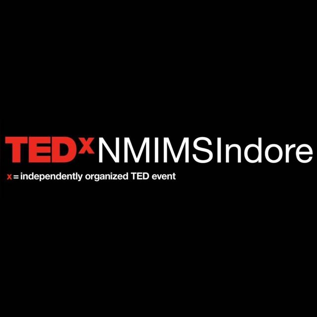

# TEDxNMIMS, Indore official website

---

---

This is the official website of TEDxNMIMS, Indore.

---

Some information regarding the website and its production:

- Framework used: [React.js](https://reactjs.org)
- UI library: [Ant-design](https://ant.design/)
- Background images site: [Pixabay](https://pixabay.com/)
- Programming language: JavaScript
- Markup language: [Sass](https://sass-lang.com/)
- Code editor used: [VSCode](https://code.visualstudio.com/)

---

## Running website on local machine

---

Here are the instructions if you wish to run the website on your machine, locally:

1. [Fork](https://docs.github.com/en/get-started/quickstart/fork-a-repo) the repository.
2. [Clone](https://docs.github.com/en/repositories/creating-and-managing-repositories/cloning-a-repository) the forked repository.
3. Execute `cd TEDx-NMIMS-Indore-official-website` command in the powershell.
4. Now execute `npm i` command to install all packages used to make this website.
5. Now execute `npm start` command to run the code on your machine.